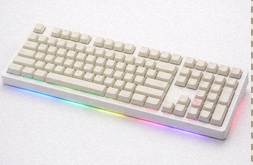
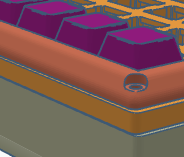

# HeroicKeyboard

I did not add all 108 keys to my model as it is very time-consuming & repetitive, 

This project is my attempt at building a fully custom mechanical keyboard experience from the ground up. The hardware side is a keyboard called HeroicKeyboard, and the software side is a configuration tool called HeroicConfigure. I’m building this with the support of Stasis (Hack Club), mostly because I’ve always wanted a keyboard that feels like mine—not just in switches and keycaps, but in firmware, layout, and software too. Since I've only used membrane keyboards, I wanted to make a keyboard that was my product, and not just something I could buy from amazon

HeroicConfigure is meant to be the companion app for HeroicKeyboard. It’s a desktop tool that lets you edit keymaps, layers, and RGB settings in a way that’s simple and doesn’t require reflashing firmware every time you want to change something. The goal is to eventually support VIA‑style live configuration, but with a cleaner UI and more control over how the keyboard behaves.

## What HeroicConfigure does right now

HeroicConfigure is still early, but the core structure is in place:

A full data model for keymaps, layers, and RGB settings

A backend system that supports multiple “device drivers”

A MockBackend that pretends to be a real keyboard so I can build the UI before the hardware arrives

A placeholder HidBackend that will eventually talk to the actual keyboard over USB HID

A profile system that can save and load keyboard configurations as JSON

A basic GUI (PySide6) that shows a keyboard layout, lets you select keys, change keycodes, and adjust RGB

The idea is that once the real keyboard PCB is ready, I can plug it in and swap the backend from mock → HID without rewriting the whole app.

## 3D Model

## Project structure
### Code
HeroicConfigure/
    main.py

    models.py

    device_backend.py

    mock_backend.py

    hid_backend.py

    profile_io.py

    via_layout.json

models.py — all the data structures (layers, key actions, RGB config, etc.)

device_backend.py — the abstract interface every backend must follow

mock_backend.py — fake keyboard for development

hid_backend.py — real USB HID backend (not implemented yet)

profile_io.py — saving and loading profiles

via_layout.json — placeholder for the real keyboard layout

## How it works (high‑level)
HeroicConfigure loads a backend (mock for now), pulls the keyboard’s current profile, and displays it in the GUI. When you click a key or change a setting, the app updates the profile and sends it back to the backend. With the mock backend, this just prints to the console. With the real backend, it’ll send HID packets to the keyboard.

The whole system is designed so the hardware and software can evolve independently. I already made most of the tool, without even getting any of the parts yet (fingers crossed, I get the parts!)

All wiring is done through the PCB. The HeroicKeyboard can connect to a device using USB-C, a 2.4 GHz Receiver, or via Bluetooth

## Why I’m building this
I wanted to learn more about:

How keyboards actually work under the hood

USB HID communication

Firmware design

Building a real desktop app

Designing something end‑to‑end instead of just writing isolated scripts

Stasis gave me the perfect excuse to finally start it.

## What’s next
Implementing the real HID protocol

Expanding the layout to match the actual HeroicKeyboard PCB

Adding per‑key RGB editing

Making the UI not look like a placeholder

Firmware work once the board arrives

## Bill of Materials
| Product Name                              | Link                                                                 | Cost per Item | Quantity | Total Cost of Item |
|-------------------------------------------|----------------------------------------------------------------------|---------------|----------|--------------------|
| GMK108 Barebones Mechanical Keyboard Kit  | https://a.co/d/0i7tCADY                                             | $69.99        | 1        | $69.99             |
| Keychron K Pro Banana Switches            | https://www.keychron.com/products/keychron-k-pro-switch?variant=40299927240793 | $0.14         | 110      | $15.40             |
| XVX White Jade Keycaps                    | https://a.co/d/0irLg7PH                                             | $0.09         | 132      | $11.88             |
| **Total:**                                |                                                                      | **$70.22**    | **243** | **$97.27**         |

## Credits & Acknowledgements:
Thank you to Stasis & the rest of the Hackclub team for (hopefully) supporting my project

I used braga3dprint's (https://www.printables.com/@braga3dprint) 3d printable design for the keycap puller

I used Copilot for suggestions, sanity checking, and the cover image (as I cannot obtain an image of the keyboard without building it, I used an AI generated image), and I used GitHub Copilot autocompletions while coding
